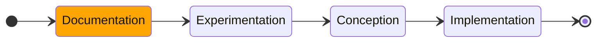

# Projet: Antivol pour cycle

## Objectif: 
Concevoir un dispostif de detection (pour la prevention de vol) et de tracage (en cas de perte), adaptable a un cycle. 
La transmission se fera par un systeme de notification et non d'emission sonore

## Problematique
* ### **<ins> DETECTION DE CHOC </ins>**
  > Comment parvenir a isoler un signal de periode inconnu ou connu (dependant des cas) afin de le traite? 
  > cf. [Document d'aide: traitement de signaux](https://vincmazet.github.io/signal2/ssp/traitement-bruit.html)
* ### **<ins> TRACAGE DE POSITION </ins>**
  > Quel reseau utiliser pour la localisation du cycle/ Quel type de traceur adopter pour la transmission de donnee de geolocalisation? 
  > cf. [Reseau et type de traceurs](https://trakmy.fr/comment-fonctionne-un-traceur-gps/)
* ### **<ins> TRAITEMENT DU SIGNAL </ins>**
  > Par quelles methodes:
  > * Isoler le signal correspondant a un choc ou un mouvement brusque a l'encontre du cycle?
  > * Analyser les donnees pour evaluer le risque?
  > * ---
* ### **<ins> TRANSMISSION DU SIGNAL </ins>**
  > Comment parvenir a l'utilisateur un statut fiable concernant l'etat de son cycle?
  > Par quelle voie emmettre les informations analysees et traitees?
* ### **<ins> ALIMENTATION </ins>**
  > Comment optimiser l'Autonomie du dispositif, tout en permettant qu'il offre un large temps d'utilisation?
  > Option de  mise en veille? option de basculement ?: le systeme coupe l'alimentation d'une composante pour une autre

## PROGRESSION DU PROJET

